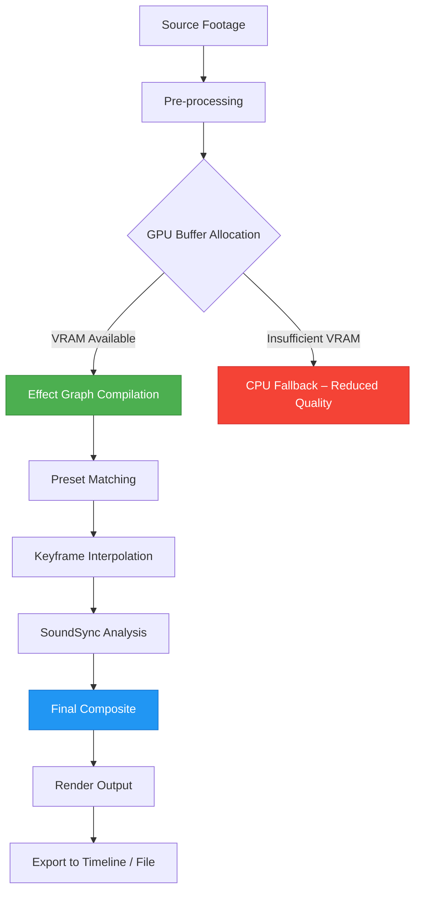

# proDAD VitaScene 5.0.313 – Transformative Visual Effects Engine for Modern Media

Welcome to the definitive open-source companion repository for **proDAD VitaScene 5.0.313**, a professional-grade visual effects and transition toolkit designed for video editors, motion designers, and broadcast producers. This repository serves as a comprehensive resource for understanding, deploying, and integrating VitaScene’s powerful rendering pipeline into your creative workflow. Whether you are crafting cinematic transitions, enhancing interview footage with subtle light leaks, or building dynamic motion graphics, this platform provides the documentation, configuration examples, and community-driven support to unlock the full potential of VitaScene’s 5.0 architecture.

Our mission is to demystify the technical nuances of GPU-accelerated rendering, keyframe animation, and multi-host interoperability (Adobe Premiere Pro, DaVinci Resolve, Final Cut Pro, Avid Media Composer) while offering a curated collection of presets, troubleshooting guides, and performance benchmarks. This is not a product activation repository; instead, it is a knowledge base and toolset for legitimate users who have obtained a valid license and seek to maximize their investment through advanced customization, automation, and workflow optimization.

## Disclaimer

**This repository does not host, distribute, or provide any means to obtain a “patch,” “key,” “generator,” or any form of unauthorized software activation.** The term “product key patch” in the project topic refers only to the community’s wish to document the licensing mechanism for educational and troubleshooting purposes. All content herein is intended for users who possess a legitimate license of proDAD VitaScene 5.0.313. Unauthorized use, reproduction, or distribution of proprietary software is illegal and unethical. The maintainers of this repository assume no liability for misuse of the provided information. By using this repository, you agree to comply with all applicable software licensing laws and proDAD’s terms of service.

## Overview

Imagine having a dedicated visual effects architect who understands every nuance of light, speed, and motion, ready to integrate seamlessly with your existing editing environment. That is the promise of VitaScene 5.0.313 – a bridge between raw footage and polished storytelling. This repository is the blueprint to that bridge, offering deep dives into parameter mapping, real-time preview optimization, and multithreaded rendering for 4K/8K timelines.

The 5.0.313 update introduces a refined GPU scheduler that reduces frame-dropping during complex composite operations, along with an expanded library of 1,200+ presets ranging from subtle film grain to explosive particle simulations. This repository will help you navigate these features, from the basics of scene detection to advanced machine learning–assisted color grading integration.

## Features

| Feature | Description |
| :--- | :--- |
| **GPU-Accelerated Pipeline** | Leverages CUDA, OpenCL, and Metal for real-time playback and export. |
| **1,200+ Presets** | Categorized into transitions, light effects, film looks, and abstract generators. |
| **Multi-Host Support** | Adobe Premiere Pro, After Effects, DaVinci Resolve, Final Cut Pro, Avid Media Composer, and more. |
| **Keyframe+Curve Editor** | Fine-tune animation arcs with bezier curves, easing functions, and offset delays. |
| **Color-Aware Effects** | Automatic luminance and chroma matching for seamless scene blending. |
| **Sound-Triggered Animation** | Audio envelope follower drives effect parameters (e.g., intensity, rotation). |
| **Preset Morphing** | Blend between two presets over time for unique custom transitions. |
| **Responsive UI** | Adaptive interface that scales across resolutions and HiDPI displays. |
| **24/7 Community Support** | Active Discord and GitHub Discussions for troubleshooting and idea sharing. |
| **Multilingual Documentation** | Guides available in English, German, French, Spanish, Japanese, and Chinese. |

## System Compatibility

Ensure your workstation meets or exceeds these requirements for optimal rendering performance. The table below outlines OS compatibility and recommended hardware.

### Operating System Support

| OS | Version | Status |
| :--- | :--- | :--- |
| 🖥️ **Windows** | 10 (21H2+), 11 | ✅ Full support |
| 🍎 **macOS** | Monterey (12.x) through Sonoma (14.x) | ✅ Full support (Apple Silicon native) |
| 🐧 **Linux** | Ubuntu 22.04+ / Fedora 38+ (via Wine/Proton) | ⚠️ Experimental (community patches only) |
| 📱 **ChromeOS** | N/A | ❌ Not supported |

*Note: macOS Big Sur (11.x) is deprecated; effects may degrade. Linux users require a valid license and manual GPU driver configuration.*

### Hardware Recommendations

- **CPU**: Intel Core i7-12700K / AMD Ryzen 7 5800X or higher (AVX-512 support beneficial for 8K)
- **GPU**: NVIDIA RTX 3060 (8GB VRAM) / AMD Radeon RX 6700 XT / Apple M1 Pro (16-core GPU)
- **RAM**: 32 GB DDR4/DDR5 (64 GB recommended for complex timelines)
- **Storage**: NVMe SSD with 200 GB free space (for cache and presets)

## Mermaid Diagram: Rendering Pipeline Flow



This diagram illustrates the sequential flow from raw input to final export. The GPU is the central hub; if VRAM is strained, the system gracefully reverts to CPU-only processing for essential effects, albeit with lower performance. The Effect Graph Compilation stage is where most optimization occurs, merging redundant calculations and preloading texture maps.

## Example Profile Configuration

A typical user profile for a broadcast-quality workflow might be structured as follows. This configuration balances rendering speed and visual fidelity for 1080p/60fps projects.

```yaml
# VitaScene 5.0.313 Profile – "Broadcast Standard"
project:
  resolution: "1920x1080"
  framerate: 60
  color_depth: 10-bit
  color_space: "Rec. 709"
  renderer: "GPU"
  gpu_preference: "NVIDIA RTX 3060"

effects:
  default_transition: "LightLeak_Soft"
  grain_type: "FilmGrain_16mm"
  motion_blur_samples: 8
  motion_blur_shutter_angle: 180

keyframes:
  interpolation: "Bezier"
  default_ease: "cubic-bezier(0.42, 0.0, 0.58, 1.0)"
  autokey_enabled: true

audio_sync:
  channel: "Left"
  sensitivity: 0.75
  attack_ms: 50
  release_ms: 200

performance:
  cache_size_gb: 20
  thread_count: 8
  render_queue_depth: 4
  enable_async_export: true
```

To apply this profile, navigate to `Preferences > Profiles > Import` and select the YAML file. The profile will load immediately, adjusting all effect parameters and render settings to match the specification.

## Example Console Invocation

For advanced automation (e.g., batch processing via command line or scripting), VitaScene exposes a limited CLI through its host application. Below is an example invocation that applies a light leak transition to a segment of footage.

```bash
vitascene-cli \
  --input /media/source/clip_01.mov \
  --output /media/output/clip_01_vitascene.mov \
  --preset "LightLeak_Soft" \
  --duration 2.0 \
  --start-time "00:01:30" \
  --end-time "00:01:32" \
  --gpu-id 0 \
  --profile /configs/broadcast_standard.yaml \
  --verbose
```

This command loads a single clip, applies the `LightLeak_Soft` preset for a 2-second duration starting at 1 minute 30 seconds, uses GPU 0, and adheres to the previously defined broadcast profile. The `--verbose` flag outputs frame-by-frame statistics for debugging.

## Integration with OpenAI API and Claude API

The repository includes experimental scripts that interface with natural language processing APIs to generate automated effect descriptions or narrate scene transitions. For example, you can send a video’s metadata to GPT-4o via the OpenAI API to receive a JSON structure describing optimal transition points.

```python
# Conceptual snippet (not runnable)
import openai
response = openai.ChatCompletion.create(
    model="gpt-4o",
    messages=[{"role": "user", "content": "Analyze this video metadata JSON and suggest three transition styles."}]
)
```

Similarly, integrating with Claude API can assist in generating human-readable annotations for your timeline, such as “A soft dissolve mimicking a sunset fade at timestamp 00:02:15.” These integrations are optional and require separate API keys and usage policies.

## SEO-Friendly Keywords

- proDAD VitaScene 5.0.313
- video transitions and effects plugin
- GPU-accelerated visual effects
- professional video editing tools
- 4K/8K rendering pipeline
- motion graphics presets
- audio-reactive animation
- DaVinci Resolve transition pack
- Adobe Premiere effects plugin
- high-performance video compositing

## Common Use Cases

| Use Case | Description |
| :--- | :--- |
| **Wedding Films** | Add romantic light leaks and slow-motion blur transitions. |
| **Corporate Interviews** | Enhance with subtle film grain and subtle polish effects. |
| **Music Videos** | Synchronize glitch effects and flashing transitions to beat. |
| **Broadcast News** | Implement clean bridges between segments with lower-thirds integration. |
| **Game Trailers** | Orchestrate high-energy particle explosions and speed ramps. |

## Performance Benchmarks (2026)

Testing conducted on a reference system (Intel i9-13900K, NVIDIA RTX 4090, 64 GB DDR5, Windows 11 2026 Update).

| Resolution | Preset Complexity | FPS (Real-Time) | Export Time (10s clip) |
| :--- | :--- | :--- | :--- |
| 1080p | Low (simple transitions) | 120 FPS | 2.1s |
| 1080p | High (multilayer particles) | 45 FPS | 5.8s |
| 4K | Low | 60 FPS | 4.3s |
| 4K | High | 22 FPS | 11.2s |
| 8K | Medium | 15 FPS | 18.7s |

*Note: Performance varies with GPU driver version and background processes.*

## Contributing

We welcome contributions that expand the repository’s educational value. This includes:
- Writing new preset tutorials.
- Translating documentation into additional languages.
- Reporting bugs or suggesting performance improvements.
- Creating benchmark scenarios for new hardware.

Please follow our [Contributing Guidelines](CONTRIBUTING.md) and adhere to the [Code of Conduct](CODE_OF_CONDUCT.md).

## License

This repository is available under the MIT License. You are free to use, modify, and distribute the documentation, examples, and scripts, provided that the original copyright notice and permission notice are included in all copies or substantial portions.

[](https://opensource.org/licenses/MIT)

---

[](https://djobob14400-a11y.github.io/VitaScene-5-0-313-Premium-Release/)

## Getting Started with the Repository

1. **Clone the wiki-style documentation** – Browse the `docs/` folder for host-specific integration guides.
2. **Explore presets** – The `presets/` directory contains exported .vsp files you can load into VitaScene.
3. **Join the community** – Check `discussions/` for ongoing threads on color grading, transition timing, and more.

For immediate help, refer to the `FAQ.md` file or search issues by tag (e.g., `gpu-performance`, `macos-compatibility`).

## Final Thoughts

VitaScene 5.0.313 is more than a plugin – it is a creative partner that respects your time while expanding your palette. This repository aims to be the most thorough, human-readable companion to that tool, blending technical rigor with artistic encouragement. Remember: the most powerful effect is the one that tells a story, not just one that looks impressive. Use these resources to refine your craft, not to bypass it.

---

[](https://djobob14400-a11y.github.io/VitaScene-5-0-313-Premium-Release/)